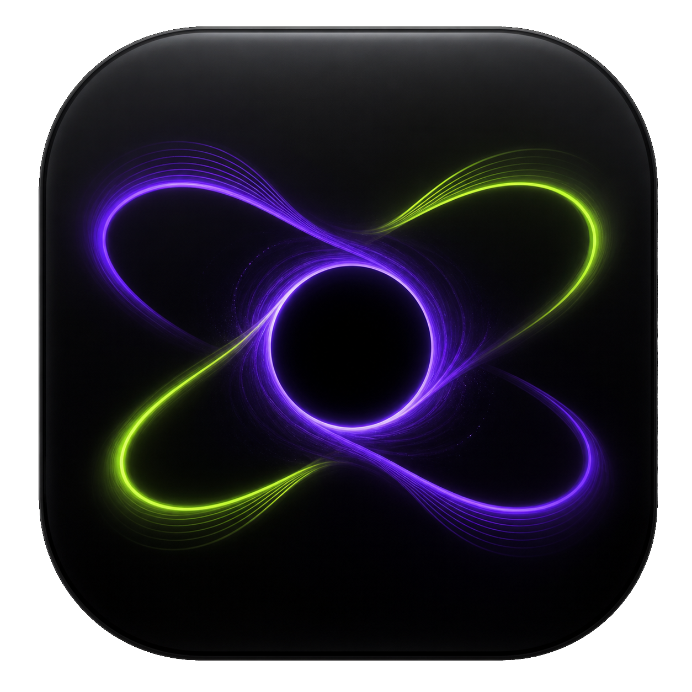
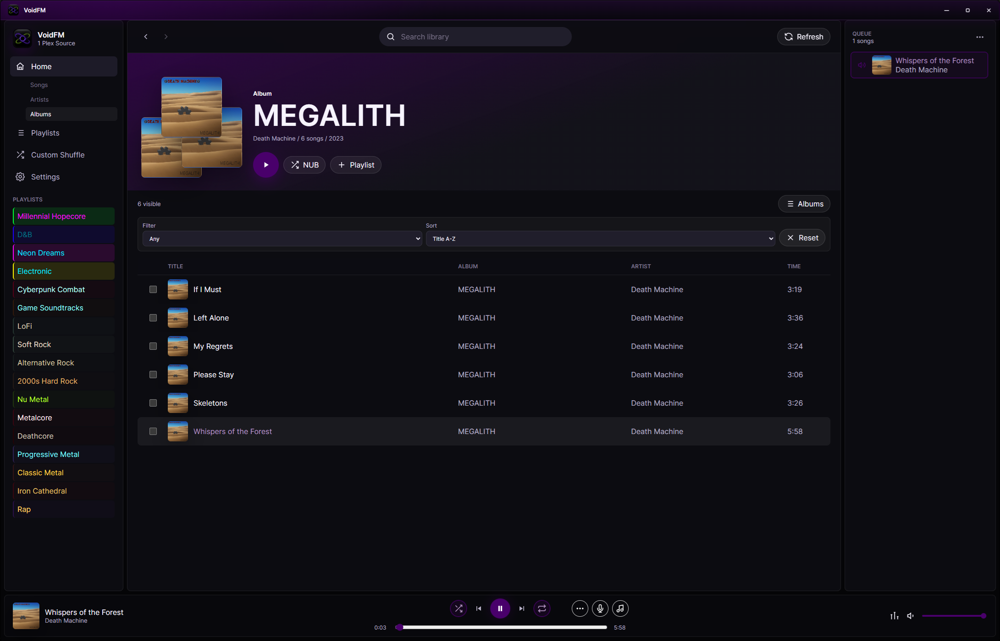
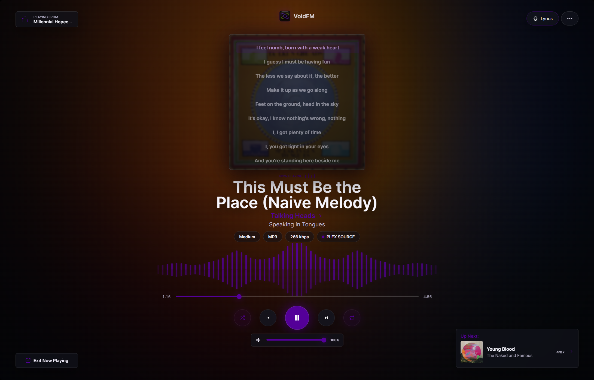
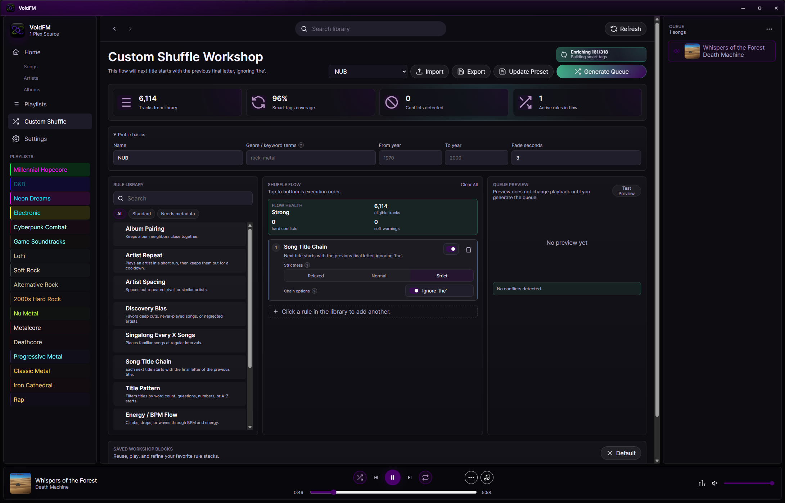
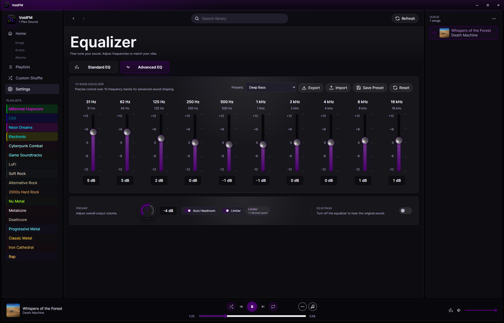
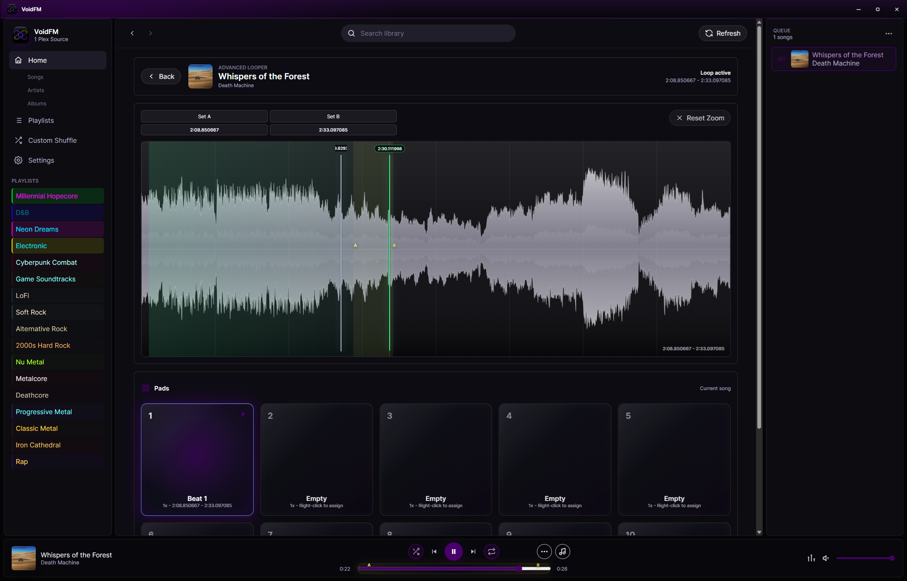
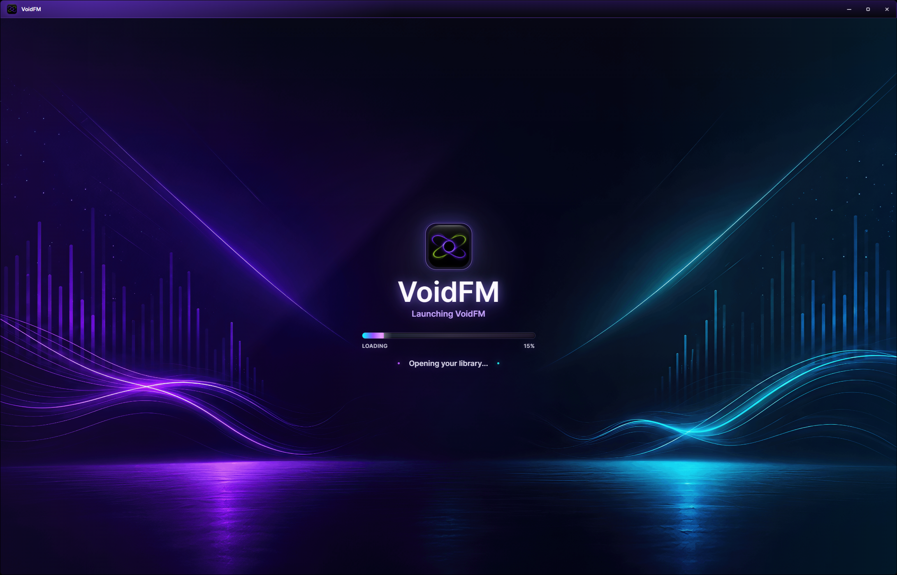

  

<h1 align="center">VoidFM</h1>

  <strong>A standalone Windows music player for people who want more control over their library.</strong>

  Use Plex or local music sources to browse, play, shuffle, organize, customize, and back up your music in one dedicated desktop app.

  

  <em>Main VoidFM interface. Click screenshots to view full size.</em>

---

## Feature Highlights

<table>
  <tr>
    <td width="50%">
      <h3>🎧 Plex And Local Music</h3>
      
Use Plex libraries or local music sources inside a dedicated Windows music player.

    </td>
    <td width="50%">
      <h3>🔀 Smarter Shuffle</h3>
      
Create shuffle profiles, reduce repeats, space out artists, and shape the queue.

    </td>
  </tr>
  <tr>
    <td width="50%">
      <h3>📀 Better Playlists</h3>
      
Create, edit, import, export, customize, recover, and build playlists with more control.

    </td>
    <td width="50%">
      <h3>🚫 Blocks And Linked Songs</h3>
      
Block music you do not want in rotation, or link tracks that belong together, like intros, skits, transitions, and companion songs.

    </td>
  </tr>
  <tr>
    <td width="50%">
      <h3>🎚️ Playlist EQ</h3>
      
Give each playlist its own EQ settings so different styles can play the way they should.

    </td>
    <td width="50%">
      <h3>🎛️ Loop Launchpad</h3>
      
Assign custom loops from a track and replay favorite sections in new sequences.

    </td>
  </tr>
  <tr>
    <td width="50%">
      <h3>🎤 Lyrics, Chords, And Loops</h3>
      
View lyrics, sync chords, pop out windows, loop sections, and use waveform tools.

    </td>
    <td width="50%">
      <h3>🎚️ Playback Control</h3>
      
Use EQ presets, crossfade, soft skips, persistent queues, caching, and playback recovery.

    </td>
  </tr>
  <tr>
    <td width="50%">
      <h3>🧰 Local And Recoverable</h3>
      
Keep playlists, settings, rules, history, metadata, and backups stored locally.

    </td>
    <td width="50%">
      <h3>🖥️ Built For Windows</h3>
      
Launch VoidFM as its own desktop app with a custom window, icon, installer, and shortcuts.

    </td>
  </tr>
</table>

---

## Screenshots

<table>
  <tr>
    <td align="center" width="50%">
      
       
      <strong>Now Playing</strong>
       
      Focus on the current track, artwork, queue, and playback controls.
    </td>
    <td align="center" width="50%">
      
       
      <strong>Custom Shuffle</strong>
       
      Build smarter shuffle profiles and control how your library flows.
    </td>
  </tr>
  <tr>
    <td align="center" width="50%">
      
       
      <strong>Equalizer</strong>
       
      Tune playback with EQ controls, presets, and playlist-specific EQ settings.
    </td>
    <td align="center" width="50%">
      
       
      <strong>Looper</strong>
       
      Loop sections, place markers, assign loop pads, and replay exact parts of a track.
    </td>
  </tr>
  <tr>
    <td align="center" colspan="2">
      
       
      <strong>Loading Screen</strong>
       
      A dedicated startup screen before jumping into your library.
    </td>
  </tr>
</table>

---

## Why VoidFM?

VoidFM is built for people who want more from their music player than basic playback.

It gives you a dedicated desktop app for Plex and local music, with smarter shuffle, stronger playlist tools, library rules, playlist-specific EQ, lyrics, chords, looping, local backups, and recovery features.

It is designed for personal libraries, shared libraries, large collections, and listeners who want more control over how their music plays.

---

## What It Does

- Plays music from Plex or local sources
- Browses songs, artists, albums, and playlists
- Creates smarter shuffle profiles
- Builds and edits custom playlists
- Blocks tracks, artists, albums, or genres from playback
- Links songs that should play before or after each other
- Supports lyrics, synced lyrics, and chords
- Includes EQ, crossfade, soft skips, and loop tools
- Applies EQ settings per playlist
- Lets users assign custom loops to a launchpad
- Saves queue and playback state
- Stores app data locally
- Exports and recovers user data
- Backs up important database and playlist state

---

## Library Rules

VoidFM lets you control what plays and what stays out of the way.

Block tracks, artists, albums, or genres you do not want in rotation. This can be useful for shared libraries, large collections, or libraries with music you want available but not included in normal playback.

You can also link songs together when they belong as a set. Use linked-song rules for intros, skits, transitions, hidden-track pairings, companion songs, or anything that should always play before or after another track.

---

## Playlist EQ

Different playlists do not always need the same sound.

VoidFM lets playlists have their own EQ settings, so each playlist can be tuned to fit its style. A heavier playlist can have different EQ settings than a softer playlist, a vocal playlist, or a bass-heavy playlist.

Set the EQ once for a playlist, then let VoidFM apply it when that playlist plays.

---

## Looper And Launchpad

VoidFM includes a looper for replaying specific parts of a song.

You can mark custom loops from a track and assign them to a launchpad, then trigger those sections in new sequences. This can be used for hooks, riffs, breakdowns, bridges, samples, or any part of a track you want to replay more directly.

In its current state, getting loops dialed in can be a bit awkward, but the feature is designed to make looping more interactive over time.

---

## Features

### App

- Standalone Windows `.exe`
- Simple Windows installer
- Desktop and Start Menu shortcuts
- Dedicated desktop window
- Custom VoidFM title bar and icon

### Music Sources

- Plex sign-in
- Plex Media Server connection
- Plex music library selection
- Local music source support
- Library browsing
- Library search

### Playback

- Persistent queue
- Playback state recovery
- Crossfade playback
- Soft-skip transitions
- Audio caching
- Stream fallback handling
- Playback diagnostics

### Shuffle And Rules

- Smart shuffle profiles
- Shuffle profile import and export
- Artist spacing controls
- Repeat reduction
- Discovery track surfacing
- Genre and mood flow tuning
- Track block rules
- Artist block rules
- Album block rules
- Genre block rules
- Block songs from shared libraries you do not want in rotation
- Linked-song rules for tracks that should play together
- Before and after rules for intros, skits, transitions, and companion tracks

### Playlists

- Playlist creation and editing
- Playlist import and export
- Custom playlist artwork
- Custom playlist colors
- Per-playlist fade settings
- Per-playlist EQ defaults
- Per-track playlist trims
- Queue-to-playlist creation
- Playlist backup recovery

### Lyrics, Chords, And Practice

- Synced lyrics
- Plain lyrics
- Library-wide lyrics scanning
- Chord sync tools
- Chord import support
- Pop-out lyrics window
- Pop-out chords window
- A/B looping
- Waveform loop editor
- Waveform markers
- Loop pads
- Loop launchpad for custom track sections

### EQ And Audio

- Built-in equalizer
- Standard EQ mode
- Advanced EQ mode
- EQ preset import and export
- Per-playlist EQ defaults
- Playlist-specific EQ playback

### Local Data And Recovery

- Local settings storage
- Local playlist storage
- Local playback state storage
- Local rules storage
- Local metadata storage
- Artwork caching
- Listening history
- Full user-data backup export
- Automatic database backups
- Critical-state recovery backups

---

## Requirements

- Windows 10 or newer
- Plex account and Plex Media Server for Plex libraries
- Local music files or folders for local source playback

---

## Installation

Download the Windows installer, run it, and launch VoidFM from the desktop or Start Menu shortcut.

Connect a Plex library or add a local music source, then start listening.

---

## Status

VoidFM is a work in progress.

This project was vibe coded and built through experimentation, iteration, and feature testing.

Expect rough edges, active changes, and ongoing improvements. Some features, especially advanced loop editing, may still be awkward while they continue to improve.

---

## Known Issues

- Some tracks may take longer than expected to load.
- Clicking `Save` on many screens can take a while, with no visible loading or pending indicator. A proper save indicator is planned.
- Soft skip may occasionally fail to trigger.
- Chords and lyrics may not always align perfectly, which can cause the auto-scrolling chord sheet to skip lines.
- Automatic chord search is currently unreliable. For best results, disable auto chord search and add chords manually for each track.
- Lesser-known songs may not have synced karaoke-style lyric data available online. When synced lyric data is unavailable, auto-scrolling lyrics will not work.
- Auto-scrolling chords depend on synced lyric data. If a track does not have synced lyric data, auto-scrolling chords will not work for that track.
- If the lyrics pop-out is open and you skip to a track that did not have lyrics loaded when the window opened, it may continue showing “no lyrics” even after lyrics have been scanned. Close and reopen the pop-out window to refresh it.

---

## Disclaimer

VoidFM is an independent project and is not affiliated with, endorsed by, or sponsored by Plex.
